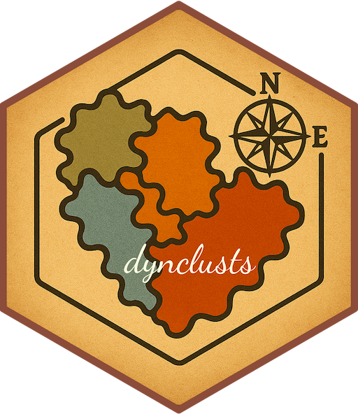
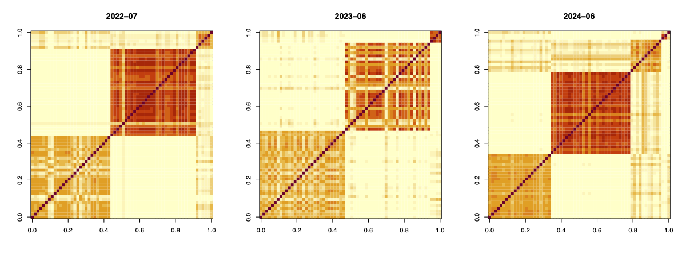
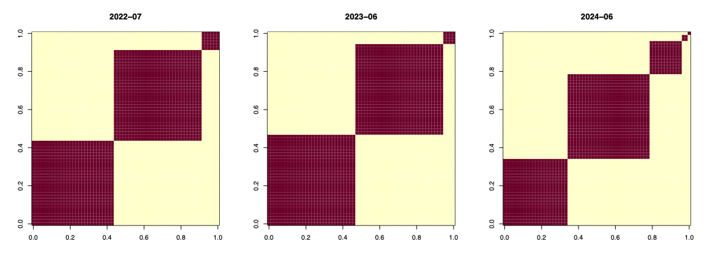
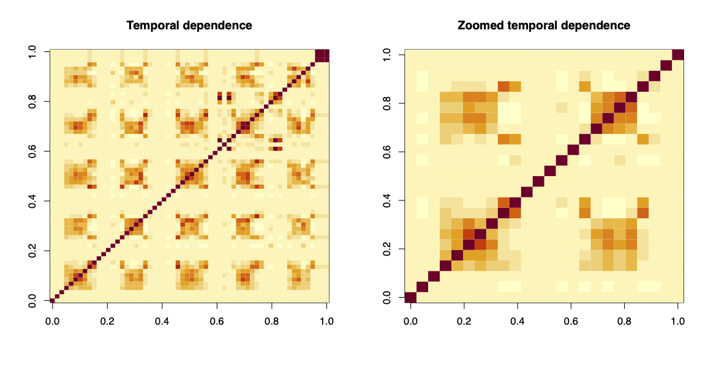

# dynclusts  

<!-- badges: start -->

[](https://github.com/marinsantiago/dynclusts/workflows/R-CMD-check/badge.svg)
[](https://lifecycle.r-lib.org/articles/stages.html#experimental)

<!-- badges: end -->

</br>

## Overview

The R package `dynclusts` (developer's version) performs Bayesian nonparametric dynamic
clustering through an [autoregressive logistic-beta Stirling-gamma process](https://arxiv.org/abs/2601.04625) 
as described in Marin et al. (2026+).

## Installation

You can install the latest developer's version via `pak` as:

``` r
# install.packages("pak")
pak::pak("marinsantiago/dynclusts")
```

On the other hand, if you wish to install the package from the `dynclusts.zip` file in the supplementary materials to Marin et al. (2026+):

  1. In R, set your working directory to the folder `dynclusts`.
  
  2. Run the following R code:
  
``` r
# install.packages("devtools")
devtools::build()
devtools::install()
```

A detailed *changelog* is available [here](https://github.com/marinsantiago/dynclusts/NEWS.md).

## Usage

Let's start by loading the Chilean FSP data from Marin et al. (2026+).

``` r
data(chile)
```

Now, let's construct `y`, `X`, and `coords` as described in Marin et al. (2026+).

``` r
s <- split(chile, chile$name)
# We assume every station has the same number of observations
T.tot <- nrow(s[[1]])
n <- length(s)
y <- sapply(s, \(d) d$pm25)
coords <- sapply(s, \(d) c(d$longitude[1], d$latitude[1])) |> t()
X <- lapply(
  s, \(d) {
    cbind(
      sin(d$windDir * pi / 180), cos(d$windDir * pi / 180),
      d$windSpeed, d$hum, d$hum ** 2
    )
  }
)
colnames(coords) <- c("longitude", "latitude")
rownames(y) <- s[[1]]$date
names(X) <- rownames(coords) <- colnames(y)
```

The main routine of the package, `dynclust()`, performs Bayesian nonparametric dynamic 
clustering through an autoregressive logistic-beta Stirling-gamma process.

``` r
set.seed(1)
dynclusts.out <- dynclusts::dynclust(
  y = y, coords = coords, X = X, theta.0 = mean(y), 
  sigma2.0  = 2 * var(c(y)),a.0 = 0.1, b.0 = 0.1, a.alpha = 1, 
  b.alpha = 0.25, max.iters = 20000L, burn.in = 10000L, thin = 5L
)
```

The return is an object of class `dynclusts`.

``` r
class(dynclusts.out)
```

``` r
"dynclusts"
```

One can then obtain a point estimate of the underlying clustering structure using the function `clustering`.

``` r
clustering.dynclust <- dynclusts::clustering(dynclusts.out)
S.dynclust <- clustering.dynclust$clusters
```

To retrieve (and then visualize) the posterior co-clustering probabilities at a given time point, one can use the
function `coclust_probs()`.

``` r
par(mfrow = c(1, 3))
time.points <- c(31, 42, 54)
for (tt in time.points) {
  pprob_matrix <- dynclusts::coclust_probs(dynclusts.out, time.point = tt)
  # Sort the observations according to the recovered partition
  ordered.obs <- order(S.dynclust[tt,])
  # Visualize posterior co-clustering probabilities
  image(pprob_matrix[ordered.obs, ordered.obs], main = row.names(y)[tt])
}
```



One can also retrieve (and then visualize) the recovered point estimate of the 
co-clustering structure at a given time point using the function `coclust_point()`.

``` r
par(mfrow = c(1, 3))
time.points <- c(31, 42, 54)
for (tt in time.points) {
  coclust_matrix <- dynclusts::coclust_point(S.dynclust, time.point = tt)
  # Sort the observations according to the recovered partition
  ordered.obs <- order(S.dynclust[tt,])
  # Visualize posterior co-clustering structure
  image(coclust_matrix[ordered.obs, ordered.obs], main = row.names(y)[tt])
}
```




Lastly, one can compute (and visualize) lagged ARI values as in Page, Quintana and Dahl (2022) 
using the function `lagged_ARI()`. The package `salso` is required. 

``` r
library(salso)
lARI <- dynclusts::lagged_ARI(S.dynclust)
par(mfrow = c(1, 2))
image(lARI, main = "Temporal dependence")
image(lARI[1:24, 1:24], main = "Zoomed temporal dependence")
```



Additional guidelines for using the package functions are referred to their help pages in R.

Source code and data to reproduce the results from Marin et al. (2026+) are available 
at [https://github.com/marinsantiago/dynclusts-applications](https://github.com/marinsantiago/dynclusts-applications).

## <a name="cite"></a> Citation

If you use any part of this code in your work, please consider citing our paper:

```
@misc{marin_dynclusts,
  title         = {{B}ayesian nonparametric modeling of dynamic pollution clusters through an autoregressive logistic-beta {S}tirling-gamma process}, 
  author        = {Santiago Marin and Bronwyn Loong and Anton H. Westveld},
  year          = {2026},
  eprint        = {2601.04625},
  archivePrefix = {arXiv},
  primaryClass  = {stat.ME}
}
```

## Disclaimer

The software is provided "as is," without warranty of any kind, express or implied,
including but not limited to the warranties of merchantability, fitness for a particular
purpose and noninfringement. In no event shall the authors or copyright holders be liable
for any claim, damages, or other liability, whether in an action of contract, 
tort or otherwise, arising from, out of, or in connection with the software or the use
or other dealings in the software.

## <a name="refs"></a> References

Marin, S., Loong, B., and Westveld, A. H. (2026+), "Bayesian nonparametric modeling of dynamic pollution clusters through an autoregressive logistic-beta Stirling-gamma process"

Page, G. L., Quintana, F. A., and Dahl, D. B. (2022), "Dependent modeling of temporal sequences of random partitions." *Journal of Computational and Graphical Statistics*, **31**(2):614-627. 
<doi:10.1080/10618600.2021.1987255>
